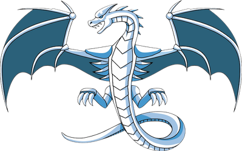

## 📝 소개

Noah VM은 가상머신의 작동 원리를 깊이 이해하고자 직접 설계 및 구현한 프로젝트입니다. 컴파일러, 레지스터 기반 가상머신, 렉서, 파서, IR 생성 등 저수준 시스템 프로그래밍 요소를 포함하고 있으며, C 언어로 개발되었습니다. 토이 언어를 컴파일하고 실행할 수 있는 환경을 제공하며, 실제 동작하는 언어의 구조를 바닥부터 경험하고 이해하는 데 초점을 맞추었습니다.

 

## 🌊 흐름

1. **소스 코드 입력**  
   `main.c` → 파일에서 코드 로드

2. **Lexing**  
   `lexer.c` → 토큰화 수행

3. **Parsing & 컴파일**  
   `compiler.c` → 토큰을 IR(중간 표현)으로 변환

4. **정적 분석 (옵션)**  
   `analyzer.c` → Dead Store Elimination(DSE) 실행

5. **프로그램 로딩**  
   `vm.c` → IR을 VM 메모리에 로딩

6. **실행**  
   `vm.c` → 가상머신 스택/레지스터 기반으로 IR 실행

7. **후처리**  
   `vm_stack_dump()` → 스택 출력
   `vm_destruct()` → 리소스 해제

 

## ⚙ 기술

  

 

## 🐛 트러블슈팅

- ABA 문제

 

## 📚 참고자료

**Engineering a Compiler** (3rd ed.) by Keith D. Cooper & Linda Torczon

[bm - tsoding](https://github.com/tsoding/bm)
